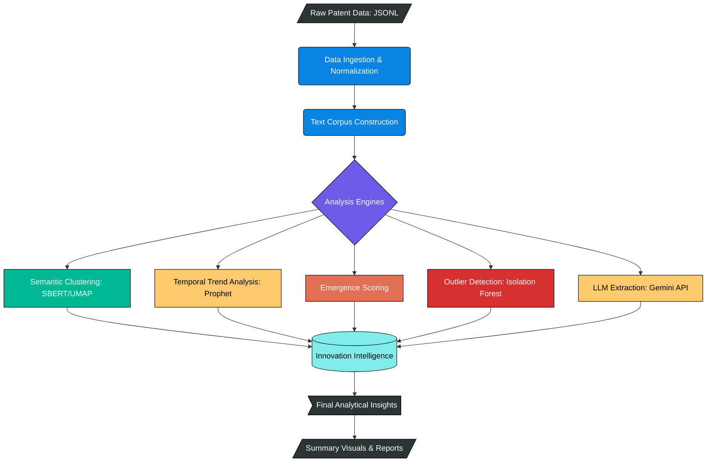
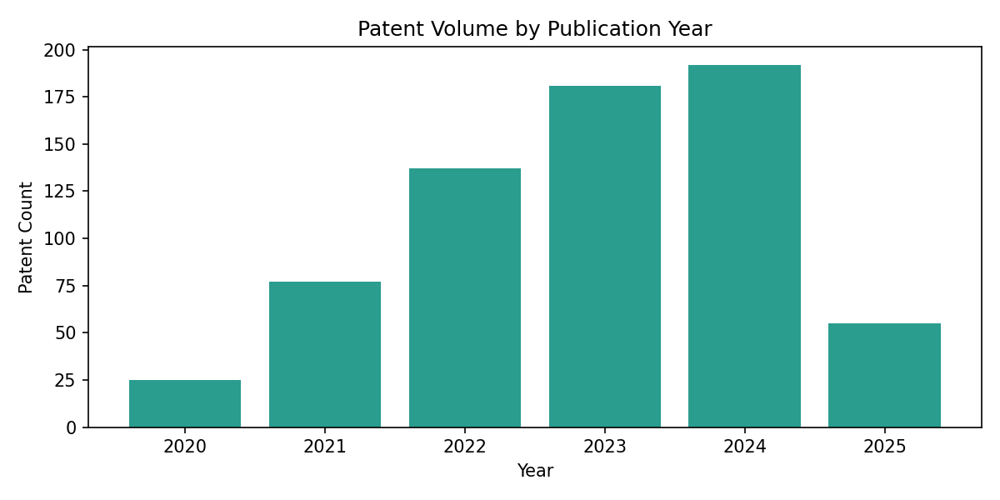
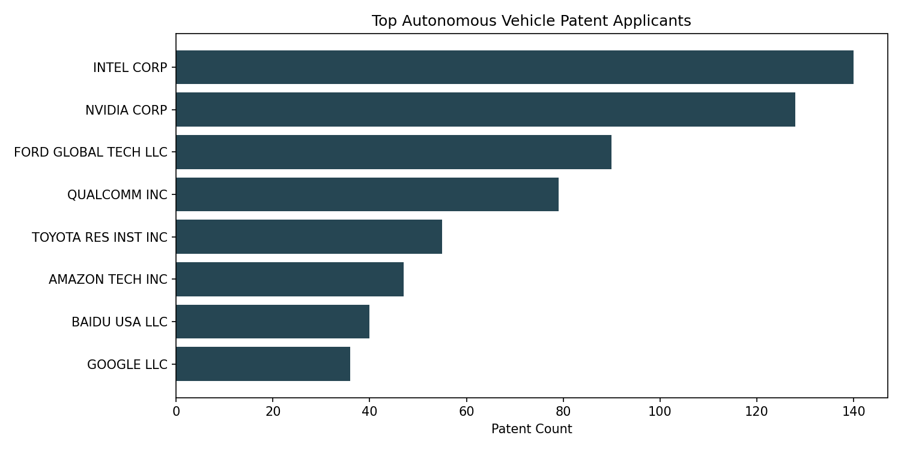

# AV Technology Patent Mining

[](https://opensource.org/licenses/MIT)
[](https://www.python.org/downloads/)

A data-driven pipeline for mining, analyzing, and visualizing trends in Autonomous Vehicle (AV) patents. This repository transforms raw patent data into innovation intelligence through semantic clustering, temporal forecasting, and LLM-powered structured extraction.

## Project Overview

The autonomous vehicle industry contains a vast volume of intellectual property. This project provides an analytical framework to identify emerging technologies, dominant applicants, and novel outliers using the following methodologies:

- **Semantic Embedding Clusters**: Categorization of patents by technological concept using SBERT and UMAP.
- **Temporal Trend Forecasting**: Projection of innovation trajectories using Facebook Prophet.
- **Outlier Detection**: Identification of niche innovations using Isolation Forests.
- **LLM Synthesis**: Conversion of long-form patent claims into structured technical summaries using the Gemini API.

## System Architecture



## Getting Started

### Prerequisites
- Python 3.10 or higher
- [Optional] Google Gemini API Key (for structured extraction)

### Installation
```bash
# Clone the repository
git clone https://github.com/aniketqxp/av-tech-trends-patent-mining.git
cd av-tech-trends-patent-mining

# Create and activate virtual environment
python -m venv .venv
source .venv/bin/activate  # On Windows: .\.venv\Scripts\activate

# Install dependencies
pip install -r requirements.txt
```

### Quick Start
Execute the core pipeline via the root-level entry point:
```bash
python main.py
```

## Project Structure

- `src/`: Modularized core execution logic and data loaders.
- `notebooks/`: Analytical notebooks for sequential stages of analysis.
- `data/`: Curated dataset of ~700 AV patents (2020–2025).
- `assets/figures/`: Generated analytical visualizations and plots.
- `reports/`: Consolidated project reports and presentations.

## Visual Analysis





<!-- Placeholder for Semantic Cluster Plot -->
<!--  -->

## License
This repository is licensed under the MIT License. See [LICENSE](LICENSE) for details.
